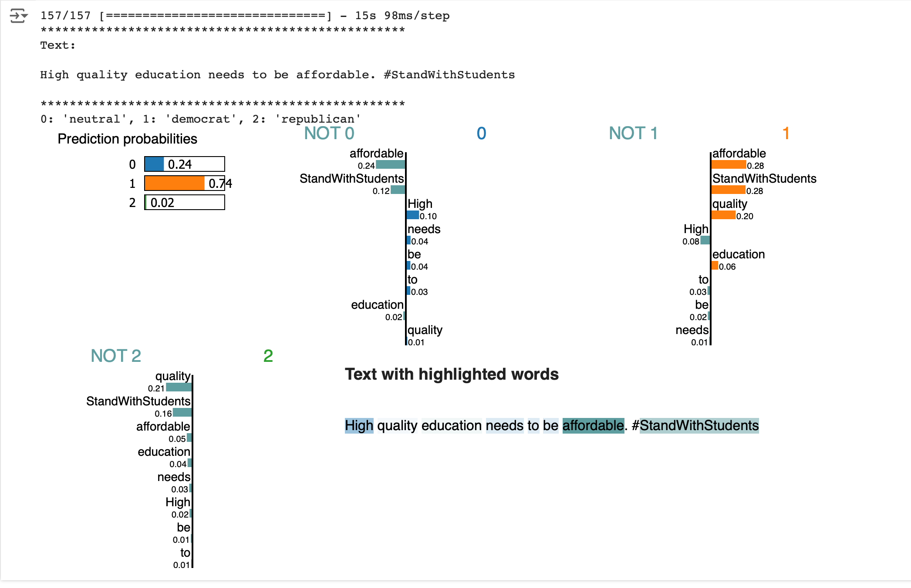

# A tweeter potical inclination classifier

A neural network that classify a tweet according to its political inclination

- Trained on 60k tweets from 20 US politicians from both Democratic and Republican party. Tweets are labeled by OpenAI GPT 3.5 into 3 classes: Democratit, Republican and Neutral
- Trained on Google Colab with T4 GPU for 5 epochs
- Achieved an overall accuracy of 70% across the 3 classes
- preprocess_data.py contains scripts to label raw tweets using OpenAI API and clean input tweets before feeding them to the model. I have used a prompt based on this papaer https://arxiv.org/pdf/2304.06588
- train.py trains a neural network using LSTM(bidirectional) and CNN in parallel. I used the tensorflow vectorizer layer to tokenize tweets and a pretained embendding layer with weights downloaded from Stanford University Glove project. ref: https://nlp.stanford.edu/projects/glove/
- train.py contains also codes to implement the LIME model prediction explainer.

An example of LIME model prediction explainer plot:

